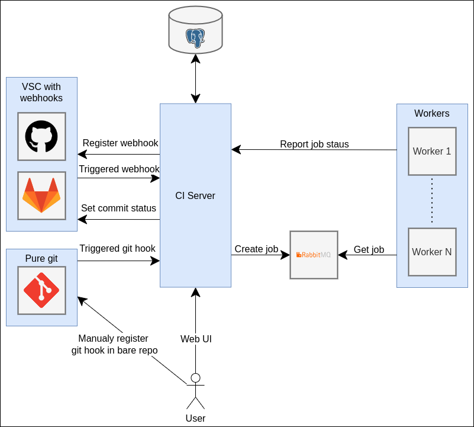

# SharkCI

CI server written in Go

## Architecture

## Env variables

| Key                    | Default                     | Description                |
|------------------------|-----------------------------|----------------------------|
| `HOST`                 |                             | Hostname.                  |
| `PORT`                 | `8080`                      | Port.                      |
| `SECRET_KEY`           | `insecure-secret`           | Random key for encryption. |
| `MONGO_URI`            | `mongodb://localhost:17017` | RabbitMQ URI.              |
| `RABBITMQ_URI`         | `amqp://localhost:5672`     | RabbitMQ URI.              |
| `GITHUB_CLIENT_ID`     |                             | GitHub client ID.          |
| `GITHUB_CLIENT_SECRET` |                             | GitHub client secret.      |
| `GITLAB_CLIENT_ID`     |                             | GitLab client ID.          |
| `GITLAB_CLIENT_SECRET` |                             | GitLab client secret.      |
